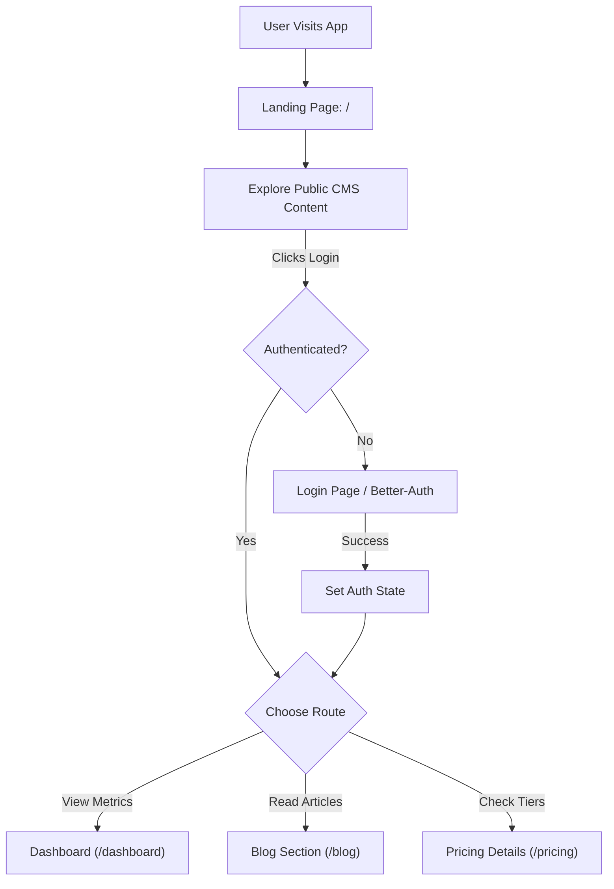

# Strapi Backend API

Welcome to the backend repository for our Strapi application. This project serves as a Headless CMS providing structured content data through a REST API to our frontend applications.

---

## 1. Getting Started

Strapi comes with a full-featured Command Line Interface (CLI) which lets you scaffold and manage your project in seconds.

### 2. Prerequisites

Ensure you have [Node.js](https://nodejs.org/) and npm (or yarn) installed on your machine.

### 3. Installation

Clone the repository and install the dependencies:

```bash
cd strapi-backend
npm install
# or
yarn install
```

🛠️ Available Scripts
Inside the project directory, you can run the following commands:

develop
Starts the Strapi application with autoReload enabled. This is the recommended mode for local development (changing content types, adding plugins, etc.).

```bash
npm run dev
# or
yarn dev
```

### API for CMS

- GET /api/globle - For header footer compnent
- GET /api/landing-page - For componets of landing page (blocks )
- GET /api/articles - For Articles and blog posts
- GET /api/pricings - Pricing components

### backend env.example

```
# Server
HOST=0.0.0.0
PORT=1337

# Secrets for stapi if there

# Database
JWT_SECRET=**********
DATABASE_HOST=ep-calm-glitter-aowbjyfg-pooler.c-2.ap-southeast-1.aws.neon.tech
DATABASE_PORT=5432
DATABASE_NAME=neondb
DATABASE_USERNAME=neondb_owner
DATABASE_PASSWORD=***********
DATABASE_SCHEMA=public
DATABASE_SSL=true
DATABASE_POOL_MIN=2
DATABASE_POOL_MAX=10
```

## 4. User flow


